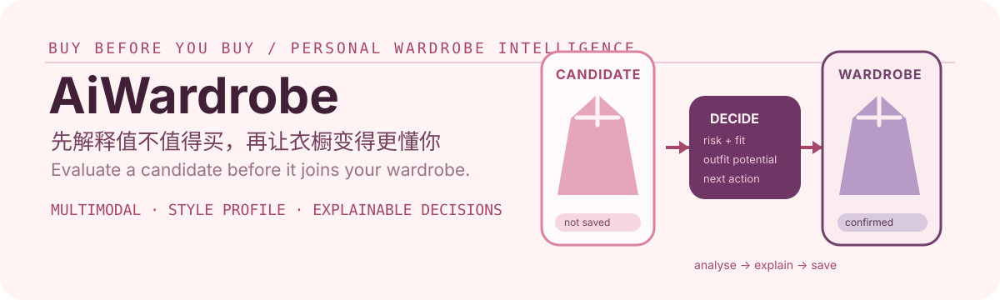

# AiWardrobe

  

  <strong>购买前 AI 衣橱决策助手</strong> 
  Understand whether an item is worth buying before it becomes part of your wardrobe.

## 这是什么 / What it is

AiWardrobe 不是只在买完后管理衣服，而是在购买前帮助用户判断一件商品是否适合自己。它将候选商品与现有衣橱、个人偏好、场景和天气关联，解释重复风险、闲置风险、搭配潜力和下一步建议。

AiWardrobe keeps a candidate separate from a confirmed garment. The wardrobe only changes after the user explicitly saves the item.

## 核心体验 / Core experience

- 邮箱登录、JWT 会话与轻量级风格偏好。
- 单件或批量衣物上传，支持客户端压缩、AI 识别和人工修正。
- 按场景、季节、温度和目标单品生成穿搭，支持历史与收藏。
- 通过商品 URL 或图片创建购买候选，展示重复风险、闲置风险、搭配潜力、衣橱相似度、价格建议和下一步动作。
- 将确认后的 PurchaseCandidate 保存为正式 Garment。
- 输出衣橱分布、场景覆盖、重复风险、低利用单品、缺口和避购建议。
- 使用 Open-Meteo 天气服务，以及 Demo 或已配置的 Taobao/Tmall 商品候选。

## 工作流 / How it works

1. 录入已有衣物，AI 生成结构化标签，用户可修正。
2. 粘贴商品链接或上传候选图片。
3. 系统将候选与已就绪衣物、偏好和场景进行比较。
4. 用户阅读结构化解释并决定购买、跳过或保存候选。
5. 只有用户确认保存后，候选才进入正式衣橱并影响未来建议。

The product optimizes for informed decisions, not for forcing every candidate into a purchase recommendation.

## 快速开始 / Quick start

Windows 下可使用一键启动：

~~~powershell
.\start.bat
~~~

默认本地模式会启动 FastAPI 后端和 Vite 前端，使用 SQLite 与本地上传存储：

- 前端 / Frontend: http://localhost:5174
- 后端 API / Backend API: http://127.0.0.1:8031/docs

也可以分别启动：

~~~powershell
.\start.bat backend
.\start.bat frontend
~~~

手动启动后端：

~~~powershell
cd backend
uv venv .venv --python python
uv pip install --link-mode=copy --python .venv\Scripts\python.exe -e ".[dev]"
.venv\Scripts\python.exe -m uvicorn app.main:app --reload
~~~

手动启动前端：

~~~powershell
cd frontend
npm install
npm run dev
~~~

## 常用 API / Useful API

- POST /purchase/analyze：根据商品 URL 创建购买候选。
- POST /purchase/analyze-image：在 URL 图片提取失败时上传候选图片。
- POST /purchase/candidates/{id}/save：用户确认后将候选转换为正式衣物。
- POST /outfits/generate：按场景、季节、天气与目标单品生成搭配。
- GET /reports/wardrobe：获取衣橱分布、缺口和风险报告。
- GET 或 PUT /preferences/me：读取或修改风格偏好。

## 模型、商品与天气配置 / Providers

Docker Compose 默认使用 AI_DEMO_MODE=true，方便本地验证。要启用真实穿搭模型，请在 .env 中关闭 Demo 并提供你的服务配置：

~~~env
AI_DEMO_MODE=false
OUTFIT_AI_PROVIDER=deepseek
DEEPSEEK_API_KEY=your-deepseek-key
DEEPSEEK_BASE_URL=https://api.deepseek.com
DEEPSEEK_MODEL=deepseek-chat
~~~

衣物识别可使用 OpenAI-compatible 多模态服务：

~~~env
AI_BASE_URL=https://your-compatible-provider/v1
AI_API_KEY=your-provider-key
AI_MODEL=your-vision-model
~~~

商品推荐默认可在 Demo 模式运行。若接入 Taobao/Tmall，请配置应用凭证；Open-Meteo 默认不需要密钥：

~~~env
SHOPPING_RECOMMENDATION_DEMO_MODE=false
TAOBAO_APP_KEY=your-taobao-app-key
TAOBAO_APP_SECRET=your-taobao-app-secret
TAOBAO_ADZONE_ID=your-adzone-id
TAOBAO_API_BASE_URL=https://eco.taobao.com/router/rest
WEATHER_PROVIDER=open_meteo
OPEN_METEO_BASE_URL=https://api.open-meteo.com
~~~

不要提交 .env 或真实第三方凭证。

## Docker / Full stack

~~~powershell
docker compose up --build
~~~

默认服务：

- 前端 / Frontend: http://localhost:5173
- 后端 / Backend: http://localhost:8000
- MinIO Console: http://localhost:9101
- PostgreSQL: localhost:5432

## 验证 / Verify

后端：

~~~powershell
cd backend
python -m pytest
~~~

前端：

~~~powershell
cd frontend
npm test
npm run build
~~~

## 许可与第三方声明 / License & third-party notices

本仓库维护者的原创贡献采用[学习与非商业使用许可](./LICENSE)：个人学习与非商业研究可免费使用；任何商业使用均须先获得著作权人的书面授权。第三方依赖、字体、素材、数据与服务仍适用各自的许可证或条款，详见[第三方声明](./THIRD_PARTY_NOTICES.md)。

商业授权请通过本仓库的 GitHub Issues，或 [维护者主页](https://github.com/xiang949876499) 联系。
